## API Rest com gerenciamento de usuários

Ola seja bem vindo ao repositorio do projeto API para gerenciamneto de Usuários. :rocket:

Este projeto consiste em uma API no padrão rest para gerenciar usuarios em uma aplicação.

Utilizei a arquitetura MSC para construir esta api, de forma que sua manutenção e adição de novas funcionalidades ficam mais faceis de se implementar.

Sua estrutura interna de arquivos  esta dividia  **Por papel técnico**.  

## Estrutura

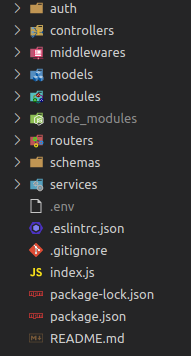

MSC - MODEL, SERVICES e CONTROLLERS

1. Pasta model e responsavel por toda interface com banco de dados, querys, conexão etc.

2. Pasta Services se concentra toda regra de negocio e chamadas ao banco de dados.

3. Pasta Controllers se dedica apenas para receber requisiçoes e direcionar ao services, e por

    consequencia receber as respostas e repassar para rotas da aplicação.

4. Pasta Schemas ficam todas as validações da aplicação, ex: regex de email etc.

5. Pasta auth Pasta referente a autenticação, mais especifico geração de JWT.

6. Pasta de middlewares ficam os middlewares, mais especifico de autenticação.

7. Pasta modules ficam as configuraçoes do SMTP de envio de email.

8. Pasta routers contem as rotas da aplicação.

## tecnologias utilizadas

- Linguagen:
    - NodeJs
-  Database: 
    - Mongodb
- Segurança: 
    - bcrypt
- Autenticaçao e autorização:
    - jsonwebtoken
- Configurações
    - Dotenv
- Envio de e-mails:
    - nodemailer
- Organização e Padronização de codigo:
    - Eslint / config-airbnb-base
- Facilitador de desenvolvimento:
    - nodemon
- framework:
    - Express

## Começando

#### Para executar o projeto, será necessário ter instalado:

1. [MongoDB](https://www.mongodb.com/try/download/community) banco utilizado para o desenvolvimento
2. [Insomnia](https://insomnia.rest/download) para fazer requisiçoes nas rotas da API. (ou qualquer outro para testes de API)

#### proximos passos

- Clone o repositorio `  git clone git@github.com:clebertonf/API-rest-gerenciamento-de-usuarios.git`
- Na raiz do projeto rode o comando **npm install** para instalar as depedências do projeto.

## Configuracão

Crie um arquivo com nome **`.env`** na raiz do projeto, dentro deste arquivo adicione as seguintes variaveis de ambiente:

MONGO_DB_URL = *Aqui insira sua url de coneção com mongo*
PORT_APP=  *Aqui insira a porta que API ira funcionar (Padrão 3000)*
JWT_SECRET= Aqui insira uma chave para geração token JWT (De preferência um hash MD5)

------

Existe uma pasta chamada modules, esta pasta possui dois arquivos de configuração do servidor de envio de e-mails, a rota `/login//forgot_password` da API necessita destas configurações para o envio de e-mail com recuperação de senha e funcionar corretamente.

Utilizei o serviço [mail trap](https://mailtrap.io/) para testes de desenvolvimento, caso ache conveniente utilize o mesmo, com as instruçoes abaixo:

1. Crie uma conta no [mail trap](https://mailtrap.io/)

2. Acesse SMTP Settings e Selecione no DropDown disponivel as configuraçoẽs para NodeJs, sera um Objeto como mostrado abaixo, nele havera suas credenciais que serão inseridas no arquivo `config.js` do projeto, copie apenas os campos mostrados no arquivo `config.js` . Feito isso seu SMTP esta pronto para envio de emails.

   ```
   var transport = nodemailer.createTransport({
     host: "seu host",
     port: sua porta, 
     auth: {
       user: "seu user",
       pass: "sua senha"
     } });
   ```


------

## Executando API

Feito isso, verifique o `package.json`, la se encontram scripts para execução do projeto.

- `"debug": "nodemon index.js",`  (`npm run debug`) inicia o projeto com nodemon.
- `"start": "node index.js",` (`npm start`) inicia o projeto com  node.

## Endpoints da API (cadastro, login, autenticaçao, recuperação de senha)

1. ####  `POST` localhost:3000/login/register

   Este endpoint registra um usuario na base de dados, o metodo é do tipo POST, e deve ser passado um JSON no corpo da Requisição conforme Abaixo:

   ```
   {
   "name": "seu nome",
   "email": "Seu email",
   "password": "Sua senha"
   }
   ```

    

O retorno: Status code : 201 com message: "Usuario criado com Sucesso!"

#### Validações:

- Todos os campos são obrigatorios:

  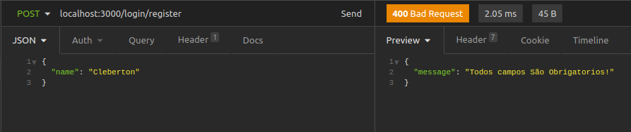

  Caso não seja informado nehum campo ou faltando, sera retornado Status code: 400 com message : "Todos campos são obrigatorios".

- Validação email:

  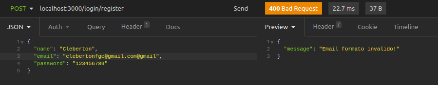

  Caso e-mail seja invalido sera retornado Status code 400 com message: "Email formato invalido".

- Validação senha:

  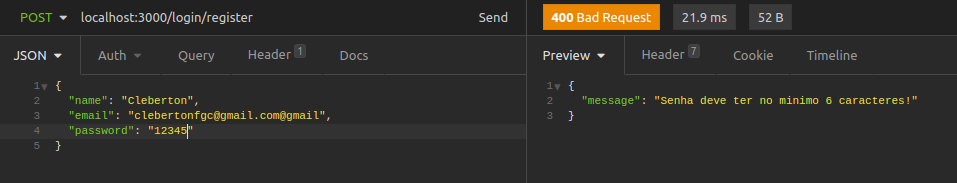

  Caso senha tenha menos que 6 carateres sera retornado Status code 400 com message: "Senha deve ter no minimo 6 caracteres".

- Validação email ja existente:

  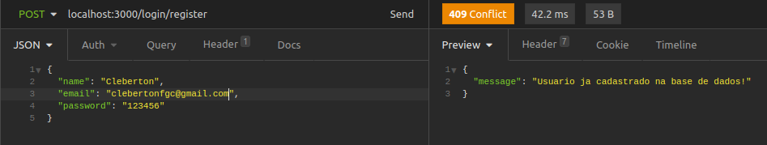

  Caso o email enviado ja exista sera retornado Status code 409 com message: "Usuario ja cadastrado na base de dados!"

2. ####  `POST` localhost:3000/login/authenticate

   Este endPoint faz o login do usuario na aplicação, O metodo e do tipo POST. E retornando um objeto com informações do usurario, e um token JWT para autenticação. Deve-se passar email e senha, conforme o exemplo abaixo:

   	{
   		"email": "Seu email",
   		"password": "Sua senha"
   	}

   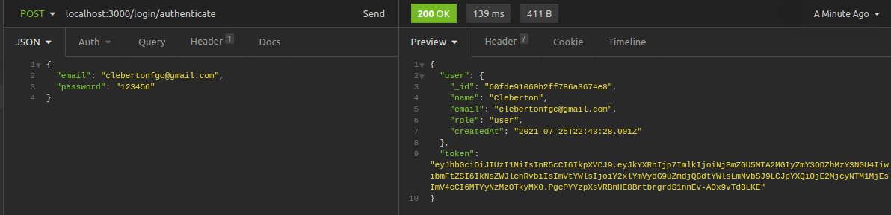

   O retorno sera status code: 200, com as informaçoes do usuario.

#### Validaçoes:

- Usuario não Existe:

  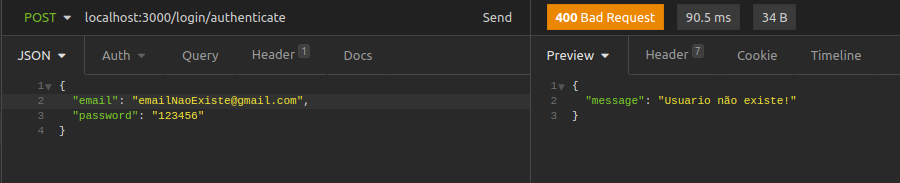

  O retorno sera status code: 400, message: "Usuario não existe!".

- Senha Invalida:

  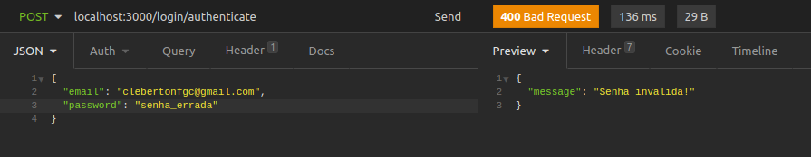

  O retorno sera status code: 400: message: "Senha invalida!"


3. #### `POST` localhost:3000/login/forgot_password

   Este endpoint dispara um e-mail para usuario cadastrado caso ele esqueça a senha, entregando um token para recuperação de sua senha. Deve-se passar o email que queria recuperar sua senha, conforme abaixo:

   ```
   {
      	"email": "Seu email",
   }
   ```

   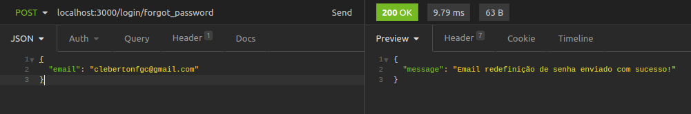

   O retorno e um status code 200, message: "Email redefinição de senha enviado com sucesso!". O email com token chega na caixa de email.

   Neste exemplo estou apenas enviando um token para o usuario via e-mail, pois a API não possui um Front-end, poderia tranquilamente enviar um link com a pagina de redefinição de senha etc. Aqui so quero demonstrar o disparo do email, este token enviado é requisitado em outra rota para a senha poder ser alterada.

   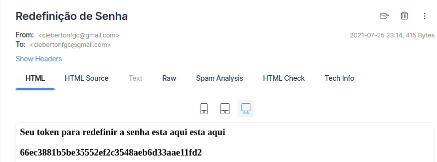

   

#### Validações

- Usuario não existe ou campo passado em branco

  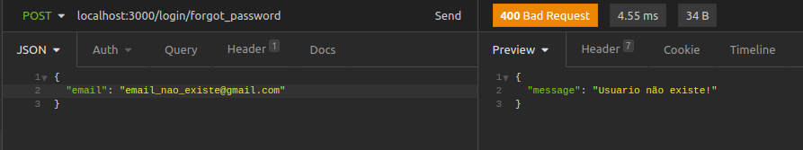

  O retorno e um status 400, message: "usuario não existe".


4. #### `POST` localhost:3000/login/reset_password

   Este endpoint faz a redefinição da senha do usuario, para ele conseguir alterar sua senha sera preciso passar alem das informaçoes de email e senha tambem o token enviado por email. Deve se passar o email, a nova senha e o token enviado pelo email, exemplo abaixo:

   ```
   {
   	"email": "Seu email",
   	"password": "Sua senha"
   	"token": "66ec3881b5be35552ef2c3548aeb6d33aae11fd2"
   }
   ```

   

   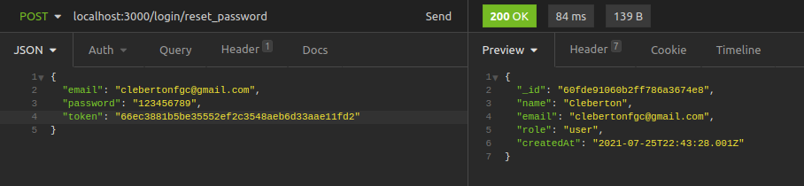

   O retorno e um status code 200, com os dados do usuario, e sua senha ja editada.

#### Validações

- Token invalido

  

  ​	O retorno sera status code: 400, message: "Token invalido!" caso usuario passe um token não gerado pela aplicação.

- Token expirado

  ​	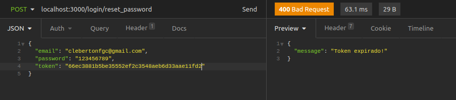

  ​	O retorno sera status code: 400, message: "Token expirado!" caso usuario passe um token que ja tenha expirado, este    	token tem a validade maxima de 1 hora.

- Email inexistente

  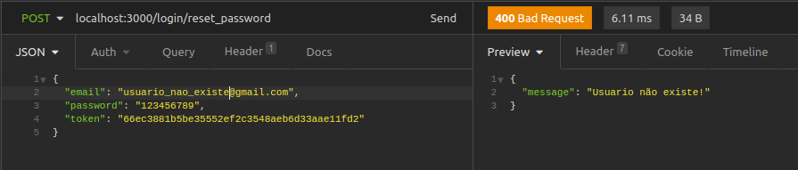

  ​	O retorno sera status code: 400, message: "usuario não existente!" caso for passado um email que não existe na base de dados.

------

## Endpoints da API (listar todos usuarios, listar usuario pelo ID,  editar e deletar usuario)

Estes endpoints deverão conter em seus headers o Token JWT enviado tanto na hora do cadastro na API tanto na Hora do login, caso contrario todas estas rotas irão retornar erro de token não encontrado. como este exemplo abaixo:

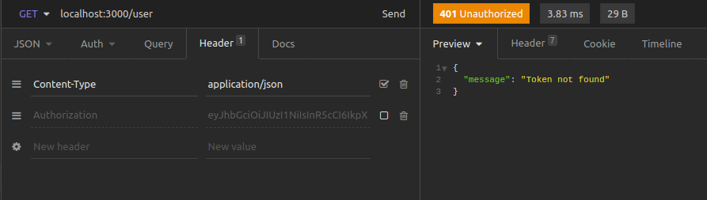

1. #### `GET` localhost:3000/user

   Este endpoint lista toos os usuarios cadastrados na base de dados, nesta rota e preciso estar com token JWT nos headers para validação de usuario logado.

   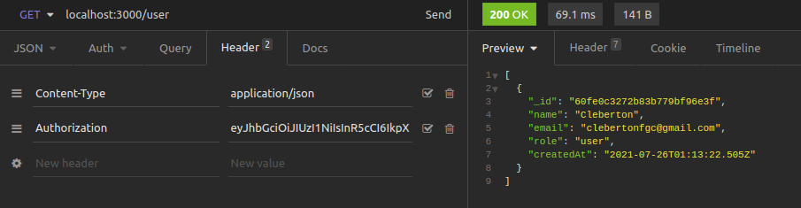

   o retorno sera status code 200, com um array de usuarios cadastrados.

#### validações

- Caso não tenha nehum usuario na base de dados

  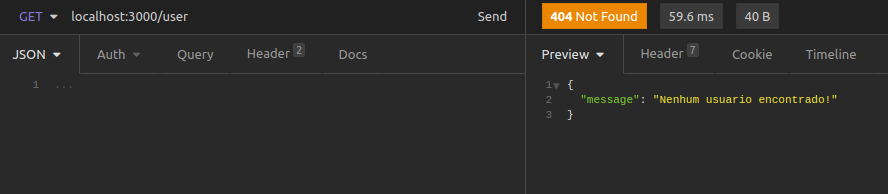

  

- Caso token não seja passado

  

  

2. #### `GET` localhost:3000/user/id_do_usuario

   Este endpoint retorna baseado no id passado na URL o usuario correspondente na base de dados.

   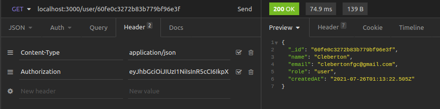

   ​	O retorno sera status code 200, com um usuario baseado no id.

#### Validações

- Ao passar um id Inexistente:

  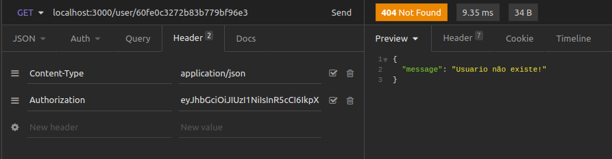

  O retorno sera status code 404, message: "Usuario não existe".


3. ####  `PUT` localhost:3000/user/id _do_usuario

   Este endpoint edita um usuario baseado em seu id passado na URL, espera-se um JSON no corpo da requisição conforme abaixo, So e permitido a alteração do email e do nome, pois a senha so e possivel editar na rota `/forgot_password`.

```
{
	"name": "Cleberton Francisco",
	"email": "clebertonfgc@gmail.com"
}
```

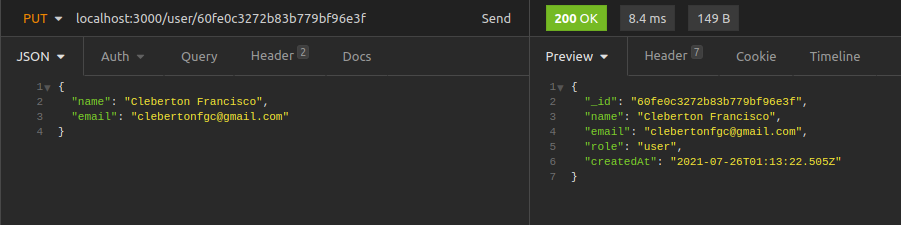

O retorno sera codigo Status 200, e as informaçoes do usuario editadas.

#### Validaçoes

- Ao passar um id inexistente:

  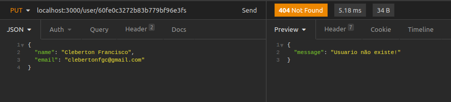

  O retorno sera codigo Status 404, message: "Usuario não existe"

 4. #### `DELETE` localhost:3000/user/id_do_usuario

     Este end point deleta um usuario cadastrado na base de dados baseado em seu id passado por parametro, basta somente passar o id correto.

     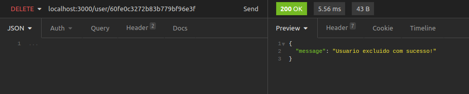

     O retorno sera Status code 200, message: "Usuario excluido com sucesso!"

  #### Validaçoes

  - Ao passar um id inexistente:

    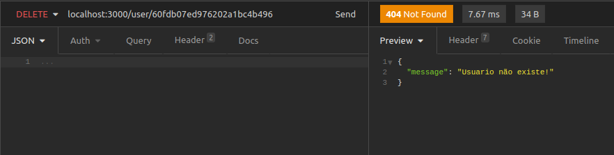

    O retorno sera codigo Status 404, message: "Usuario não existe"

  

  ------

  Por fim, esta API esta pasando por constantes evoluçoes, sinta-se a vontade para contrbuir.
