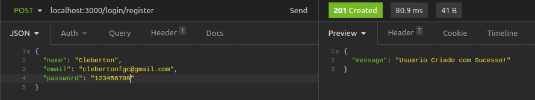

## API Rest com gerenciamento de usuários Node.JS :desktop_computer:

Olá seja bem vindo ao repositorio do projeto API para gerenciamneto de Usuários. :rocket:

Este projeto consiste em uma API no padrão rest para gerenciar usuários em uma aplicação.

Utilizei a arquitetura **`MSC`** para construir esta api, de forma que sua **`manutenção e adição de novas funcionalidades`** ficam mais faceis de se implementar.

Sua estrutura interna de arquivos  esta dividida  **Por papel técnico**.  

## Estrutura


**`MSC`** - MODEL, SERVICES e CONTROLLERS

1. Pasta model é responsável por toda interface com banco de dados, query's, conexão etc.

2. Pasta Services se concentra toda regra de negócio e chamadas ao banco de dados.

3. Pasta Controllers se dedica apenas para receber requisições e direcionar ao services, e por
    consequência receber as respostas e repassar para rotas da aplicação.

4. Pasta Schemas ficam todas as validações da aplicação, ex: regex de email etc.

5. Pasta auth é referente a autenticação, mais especifico geração de JWT.

6. Pasta de middlewares ficam os middlewares, mais especifico de autenticação.

7. Pasta modules ficam as configurações do SMTP de envio de email.

8. Pasta routers contém as rotas da aplicação.

9. Pasta public contém as imagens utilizadas no projeto.

## tecnologias utilizadas

- Linguagens:
    - NodeJs
-  Database: 
    - Mongodb
- Segurança: 
    - bcrypt
- Autenticação e autorização:
    - jsonwebtoken
- Configurações
    - Dotenv
- Envio de emails:
    - nodemailer
- Organização e Padronização de codigo:
    - Eslint / config-airbnb-base
- Facilitador de desenvolvimento:
    - nodemon
- framework's:
    - Express

## Começando

#### Para executar o projeto, será necessário ter instalado:

1. [MongoDB](https://www.mongodb.com/try/download/community) banco utilizado para o desenvolvimento
2. [Insomnia](https://insomnia.rest/download) para fazer requisições nas rotas da API. (ou qualquer outro para testes de API)

#### proximos passos

- Clone o repositório `  git clone git@github.com:clebertonf/API-rest-gerenciamento-de-usuarios.git`
- Na raiz do projeto rode o comando **npm install** para instalar as depedências do projeto.

## Configuracão

Crie um arquivo com nome **`.env`** na raiz do projeto, dentro deste arquivo adicione as seguintes variáveis de ambiente:

1. **`MONGO_DB_URL=`** *Aqui insira sua url de conexão com mongo*
2. **`PORT_APP=`**  *Aqui insira a porta que API irá funcionar (Padrão 3000)*
3. **`JWT_SECRET=`** Aqui insira uma chave para geração do token JWT (De preferência um hash MD5)


------

Existe uma pasta chamada **`modules`**, esta pasta possui dois arquivos de configuração do servidor de envio de emails, a rota `/login/forgot_password` da API necessita destas configurações para o envio de email com recuperação de senha funcionar corretamente.

Utilizei o serviço [mail trap](https://mailtrap.io/) para testes de desenvolvimento. Caso ache conveniente utilize o mesmo, com as instruções abaixo:

1. Crie uma conta no [mail trap](https://mailtrap.io/)

2. Acesse SMTP Settings e Selecione no DropDown disponivel as configurações para NodeJs, será um Objeto como mostrado abaixo, nele havera suas credenciais que serão inseridas no arquivo `config.js` do projeto, copie apenas os campos mostrados no arquivo `config.js` . Feito isso seu SMTP esta pronto para envio de emails.

   ```
   var transport = nodemailer.createTransport({
     host: "seu host",
     port: sua porta, 
     auth: {
       user: "seu user",
       pass: "sua senha"
     } });
   ```


------

## Executando API

Verifique o `package.json`, la se encontram scripts para execução do projeto.

- `"debug": "nodemon index.js",`  (`npm run debug`) inicia o projeto com nodemon.
- `"start": "node index.js",` (`npm start`) inicia o projeto com  node.

## Endpoints da API (cadastro, login, autenticação, recuperação de senha)

1. ####  `POST` localhost:3000/login/register

   Este endpoint registra um usuário na base de dados, o método é do tipo POST, e deve ser passado um JSON no corpo da Requisição conforme Abaixo:

   ```
   {
   "name": "seu nome",
   "email": "Seu email",
   "password": "Sua senha"
   }
   ```

    

O retorno: Status code : 201 com message: "Usuário criado com Sucesso!"

#### Validações:

- Todos os campos são obrigatorios:

  

  Caso não seja informado nehum campo ou faltando, será retornado Status code: 400 com message : "Todos campos são obrigatorios".

- Validação email:

  

  Caso email seja inválido será retornado Status code 400 com message: "Email formato inválido".

- Validação de senha:

  

  Caso senha tenha menos que 6 carateres será retornado Status code 400 com message: "Senha deve ter no minimo 6 caracteres".

- Validação email já existente:

  

  Caso o email enviado já exista será retornado Status code 409 com message: "Usuario já cadastrado na base de dados!"

2. ####  `POST` localhost:3000/login/authenticate

   Este endPoint faz o login do usuário na aplicação, O mátodo e do tipo POST. É retornando um objeto com informações do usuário, e um token JWT para autenticação. Deve-se passar email e senha, conforme o exemplo abaixo:

   	{
   		"email": "Seu email",
   		"password": "Sua senha"
   	}

   

   O retorno será status code: 200, com as informações do usuário.

#### Validações:

- Usuário não Existe:

  

  O retorno será status code: 400, message: "Usuário não existe!".

- Senha Inválida:

  

  O retorno será status code: 400: message: "Senha inválida!"


3. #### `POST` localhost:3000/login/forgot_password

   Este endpoint dispara um e-mail para usuário cadastrado caso ele esqueça a senha, entregando um token para recuperação de sua senha. Deve-se passar o email que queria recuperar sua senha, conforme abaixo:

   ```
   {
      	"email": "Seu email",
   }
   ```

   

   O retorno á um status code 200, message: "Email redefinição de senha enviado com sucesso!". O email com token chega na caixa de email.

   Neste exemplo estou apenas enviando um token para o usuário via e-mail, pois a API não possui um Front-end, poderia tranquilamente enviar um link com a página de redefinição de senha etc. Aqui só quero demonstrar o disparo do email, este token enviado é requisitado em outra rota para a senha poder ser alterada.

   

   

#### Validações

- Usuário não existe ou campo passado em branco

  

  O retorno é um status 400, message: "Usuário não existe".


4. #### `POST` localhost:3000/login/reset_password

   Este endpoint faz a redefinição da senha do usuário, para ele conseguir alterar sua senha será preciso passar alem das informações de email e senha também o token enviado por email. Deve se passar o email, a nova senha e o token enviado, exemplo abaixo:

   ```
   {
   	"email": "Seu email",
   	"password": "Sua senha"
   	"token": "66ec3881b5be35552ef2c3548aeb6d33aae11fd2"
   }
   ```

   

   

   O retorno é um status code 200, com os dados do usuário, e sua senha já editada.

#### Validações

- Token invalido

  

  ​	O retorno será status code: 400, message: "Token inválido!" caso usuário passe um token não gerado pela aplicação.

- Token expirado

  ​	

  ​	O retorno será status code: 400, message: "Token expirado!" caso usuário passe um token que já tenha expirado, este    	token tem a validade máxima de 1 hora.

- Email inexistente

  

  ​	O retorno será status code: 400, message: "usuário não existente!" caso for passado um email que não existe na base de dados.

------

## Endpoints da API (listar todos usuarios, listar usuario pelo ID,  editar e deletar usuario)

Estes endpoints deverão conter em seus headers o Token JWT enviado tanto na hora do cadastro na API quanto na Hora do login, caso contrario todas estas rotas irão retornar erro de token não encontrado. como este exemplo abaixo:


1. #### `GET` localhost:3000/user

   Este endpoint lista todos os usuários cadastrados na base de dados, nesta rota é preciso estar com token JWT nos headers para validação de usuário logado.

   

   o retorno será status code 200, com um array de usuários cadastrados.

#### validações

- Caso não tenha nenhum usuário na base de dados

  

  

- Caso token não seja passado

  

  

2. #### `GET` localhost:3000/user/id_do_usuario

   Este endpoint retorna baseado no id passado na URL o usuário correspondente na base de dados.

   

   ​	O retorno será status code 200, com um usuário baseado no id.

#### Validações

- Ao passar um id Inexistente:

  

  O retorno será status code 404, message: "Usuário não existe".


3. ####  `PUT` localhost:3000/user/id _do_usuario

   Este endpoint edita um usuário baseado em seu id passado na URL, espera-se um JSON no corpo da requisição conforme abaixo, Só e permitido a alteração do email e do nome, pois a senha só e possivel editar na rota `/forgot_password`.

```
{
	"name": "Cleberton Francisco",
	"email": "clebertonfgc@gmail.com"
}
```


O retorno será código Status 200, e as informações do usuário editadas.

#### Validaçoes

- Ao passar um id inexistente:

  

  O retorno será código Status 404, message: "Usuário não existe"

 4. #### `DELETE` localhost:3000/user/id_do_usuario

     Este end point deleta um usuário cadastrado na base de dados baseado em seu id passado por parametro, basta somente passar o id correto.

     

     O retorno será Status code 200, message: "Usuário excluido com sucesso!"

  #### Validaçoes

  - Ao passar um id inexistente:

    

    O retorno será código Status 404, message: "Usuário não existe"

  

  ------

  Por fim, esta API esta pasando por constantes evoluções, sinta-se a vontade para contrbuir.
